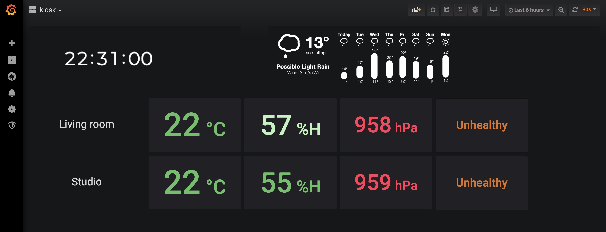
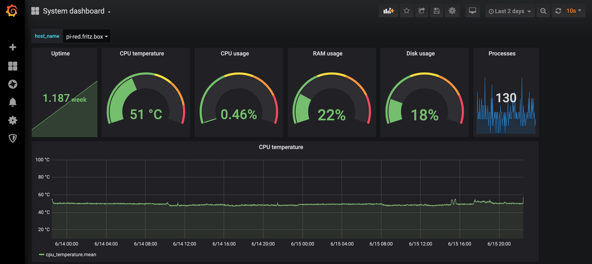

# Raspberry Pi system and weather data collection

The goal of the project is to collect and display system and weather metrics from a network or Rasperry Pis nodes placed in different locations (e.g. different rooms of your house).
Weather metrics including temperature, humidity, pressure and indoor air quality are collected via the BME680 sensor.

Example Grafana dashboards created by this project:

1. I use this dashboard as a permanent display kiosk on an Amazon Fire HD 8 to show current weather and air quality fronmdifferent rooms in my house.


2. Detailed dashboard for current and historical weather and air quality metrics.


3. Detailed dashboard for current and historical system metrics from my Raspberry Pis.


## Software components

The project includes the following software components:

- **Telegraf** running on each node to collect system and weather metrics.
- **[bme680-data-recorder]**(https://github.com/ellolo/bme680-data-recorder) running on each node to emit weather metrics from the BME680 sensor.
- **InfluxDB** and **Grafana** running on a dedicate node, to store and display the metrics collected by the Telegraf instances.
- **Docker registry** running on a dedicated node, to serve the bme680-data-recorder image to all nodes.

All the above software components run as Docker containers.

The project has been tested with two Raspberry Pis (3B+ and 4B) both equipped with BME680. The Raspberry Pi 4B runs the InfluxDB, Grafana and Docker registry instances.
The Raspberry Pi 3B+ in only used for data collection.


## Prerequisite

1. Python3 and git are installed on all machines.
2. Ansible is installed on the control node.
...

## Usage


1. Install required roles on the control node:

```
ansible-galaxy install -r requirements.yml --roles-path ./roles
```

2. Configure ``inventory`` file as needed. Note that in the provided ``inventory`` file the control node is also the managed node that runs most of the tooling (e.g. InfluxDB, Grafana).

3. Change default variables as defined in playbooks and in ``./roles/*/defaults/main.yml`` to accomodate your deployment, e.g. set hostnames.

4. Perform basic setup of managed nodes, e.g. enabling i2c, setting up required users: 

```
ansible-playbook playbook_machines_setup.yml
```

5. Install docker on all nodes and insecure docker registry on the node in the  ``docker_registry`` group: 

```
ansible-playbook playbook_docker.yml
```

6. Setup and run InfluxDB and Grafana as docker containers on the node in the ``db`` group, in a dedicate Bridge network:

```
ansible-playbook playbook_db.yml
```

7. Setup and run Telegraf as docker container on all managed nodes from which metrics have to be collected. 
If the playbook is run with the [role default variable file](https://github.com/ellolo/ansible-docker_telegraf/blob/master/defaults/main.yml), then the following metrics will be collected:

	- system metrics (Telegraf plugins: cpu, mem, disk, diskio, net, processes, file). These metrics will be collected as soon as the docker container is started.
	- weather (i.e. indoor air quality) metrics, collected via BME680 sensor. Please refer to [bme680-data-recorder](https://github.com/ellolo/bme680-data-recorder) for details on what metrics are collected and how.  These metrics will be collected only after step 8 is completed.

With the default variables, the metrics will be shipped and stored in influxDB (via Telegraf output plugin) in two separate databases, one for system metrics and one for weather metrics.

	```
	ansible-playbook playbook_telegraf.yml
	```

8. Run weather metrics collection from BME680 sensor in a docker container. The playbook will clone the [bme680-data-recorder](https://github.com/ellolo/bme680-data-recorder) repository, build the corresponding Docker image, push it to the docker registry, and start containers with that image on all managed nodes equipped with BME680. On each of these node, the container will start logging weather metrics, which will be collected by the Telegraf container setup in stup 7.

```
ansible-playbook playbook_bme680.yml
```

9. Build Grafana dashboards using the InfluxDB instance as a source. Example dahsboards are provided here: TO ADD.
